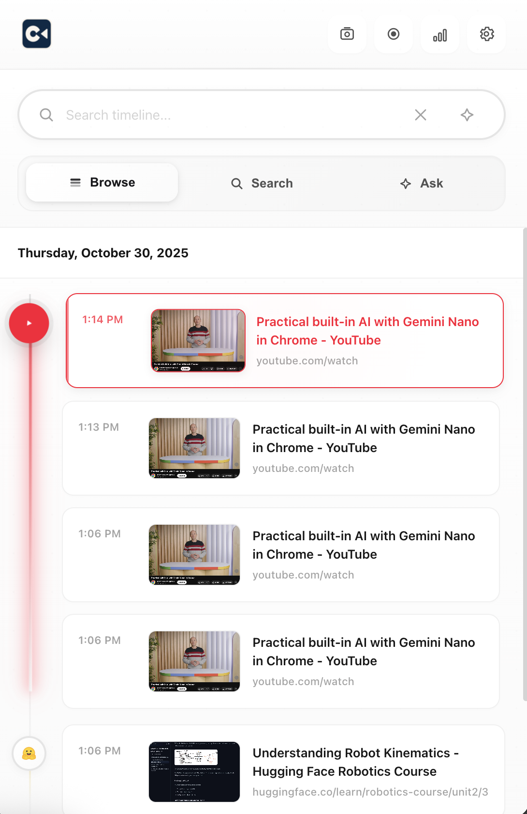
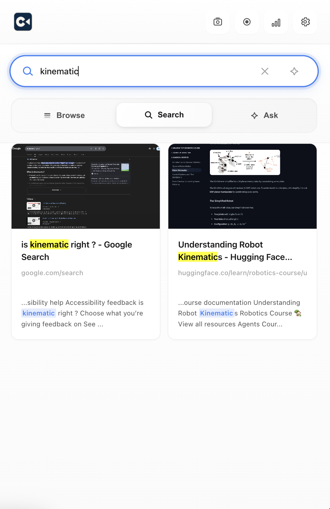
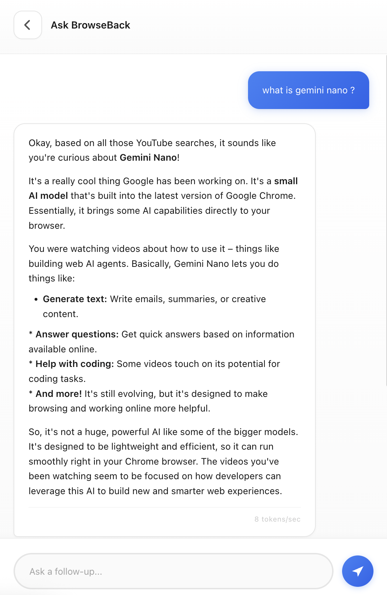
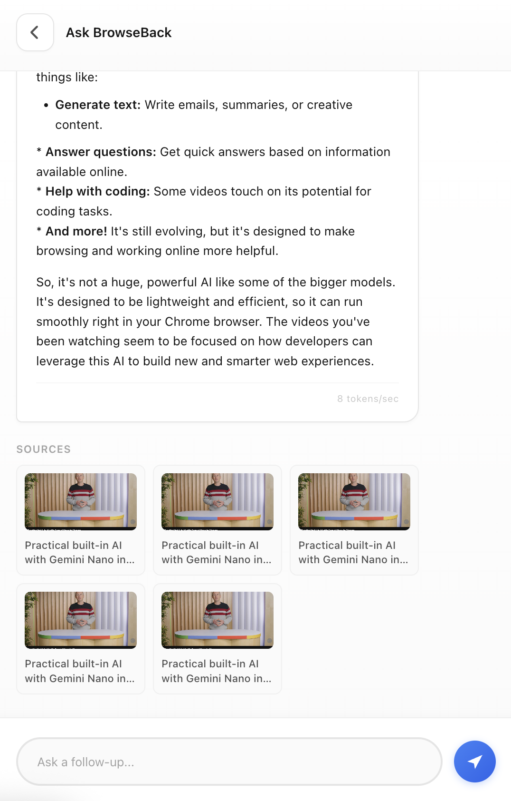
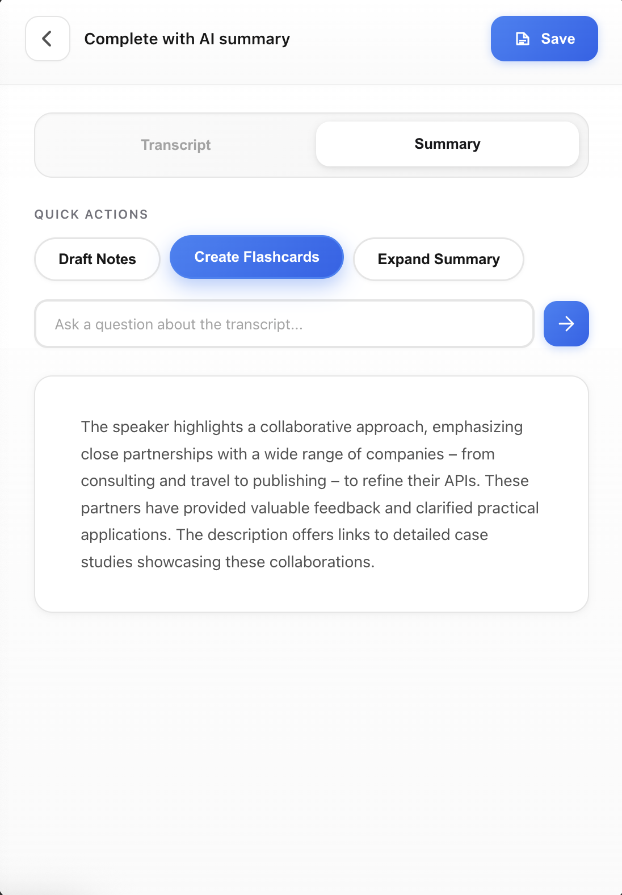
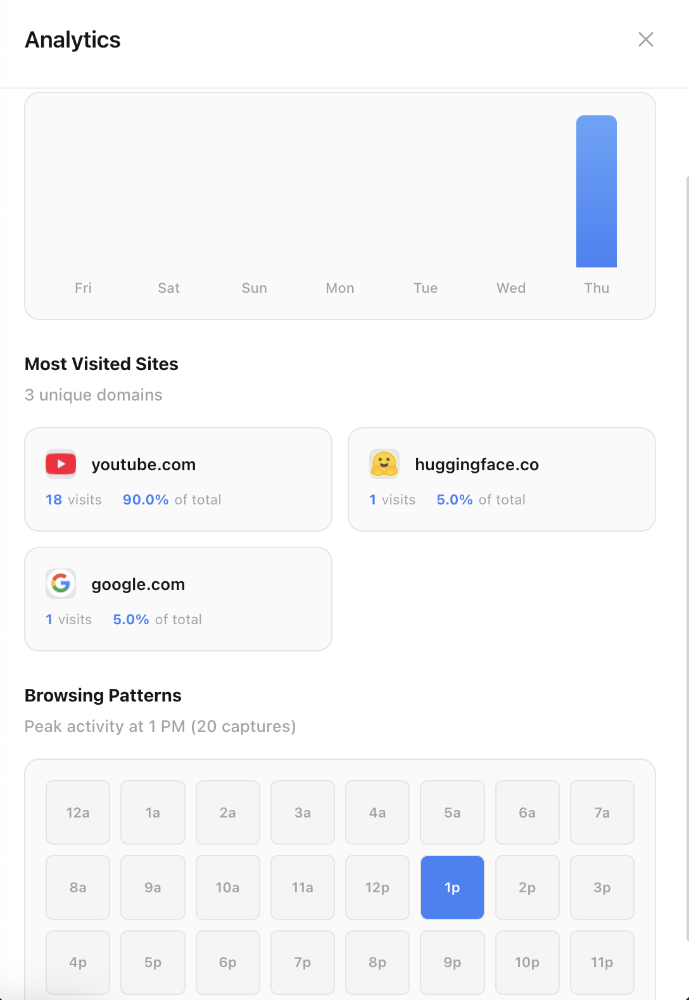
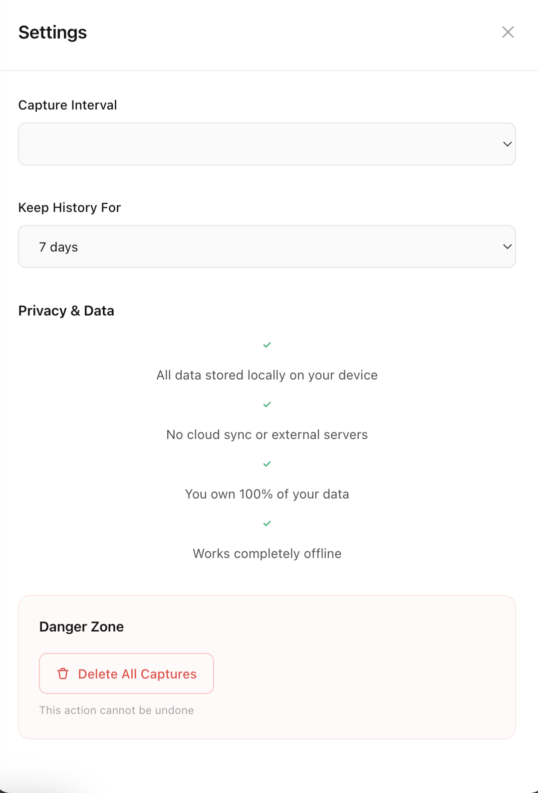
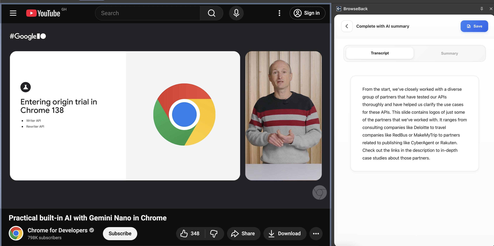

#  BrowseBack

**Your photographic browsing memory. Search everything you've seen online.**

BrowseBack is a Chrome extension that automatically captures and indexes your browsing activity, creating a searchable "photographic memory" of everything you've seen online. Unlike cloud-based alternatives like Rewind.ai, **all data processing happens locally** using Chrome's built-in AI, ensuring complete privacy.

---

## 📸 Screenshots

<table>
  <tr>
    <td width="50%">
      <h3>Timeline View</h3>
      
    </td>
    <td width="50%">
      <h3>Search Mode</h3>
      
    </td>
  </tr>
  <tr>
    <td width="50%">
      <h3>Ask Mode - AI-Powered Q&A</h3>
      
    </td>
    <td width="50%">
      <h3>Chat Follow-up Questions + Sources/Links</h3>
      
    </td>
  </tr>
  <tr>
    <td width="50%">
      <h3>Transcription Feature + Followup</h3>
      
    </td>
    <td width="50%">
      <h3>Analytics Dashboard</h3>
      
    </td>
  </tr>
  <tr>
    <td width="50%">
      <h3>Settings & Privacy Controls</h3>
      
    </td>
    <td width="50%">
    </td>
  </tr>
</table>

### Full Page View


---

## 📋 Table of Contents

- [🎯 The Problem](#-the-problem)
- [✨ The Solution](#-the-solution)
- [🔒 Privacy First](#-privacy-first)
- [👥 Use Cases](#-use-cases)
- [🚀 Installation](#-installation)
- [🎮 Usage](#-usage)
- [🏗️ Architecture](#️-architecture)
- [🎓 How It Works](#-how-it-works)
- [📚 Documentation](#-documentation)
- [🛠️ Development](#️-development)
- [🗺️ Roadmap](#️-roadmap)
- [🏆 Google Chrome Built-in AI Challenge 2025](#-google-chrome-built-in-ai-challenge-2025)
- [🎬 Demo Video](#-demo-video)
- [⚙️ Configuration](#️-configuration)
- [🤝 Contributing](#-contributing)
- [📄 License](#-license)
- [💡 FAQ](#-faq)

---

## 🎯 The Problem

- **Users forget** where they saw information online
- **Browser history** is just a list of URLs (not searchable by content)
- **Can't remember context**: "What was I researching Tuesday afternoon?"
- **Screenshots/bookmarks** require manual effort (and people forget)

## ✨ The Solution

BrowseBack runs silently in the background, automatically:

- 📸 **Capturing screenshots** of your active tab every 10 seconds
- 🔤 **Extracting text** using OCR powered by Chrome Prompt API
- 🔍 **Building a searchable local index** of all content
- 🧠 **Letting you search** by content, time, or natural language

## 🔒 Privacy First

- ✅ **100% local processing** - your browsing data never leaves your device
- ✅ **Works completely offline** - no internet required for search
- ✅ **Zero subscription fees** - no cloud costs
- ✅ **You own your data** - export or delete anytime

## 👥 Use Cases

BrowseBack is perfect for anyone who needs to recall what they've seen online:

- **🎓 Students** - Find lecture notes, research papers, and study materials you've browsed
- **💼 Executives** - Recall details from market research, competitor analysis, and reports
- **👨‍💻 Engineers** - Quickly find API docs, Stack Overflow solutions, and technical articles
- **💰 Sales Teams** - Remember product details, customer research, and competitive intel
- **🧠 People with ADHD** - Never lose track of important information in your browsing sessions
- **🔬 Researchers** - Track down sources and references you encountered during your work
- **📝 Content Creators** - Find inspiration and reference materials from your browsing history

---

## 🚀 Installation

### Prerequisites

1. **Google Chrome** (version 127+)
2. **Chrome Built-in AI Early Preview Program** enrollment
   - Sign up at: [Chrome Built-in AI](https://developer.chrome.com/docs/ai/built-in)
   - Enable flags:
     - `chrome://flags/#optimization-guide-on-device-model`
     - `chrome://flags/#prompt-api-for-gemini-nano`

### Install the Extension

1. **Clone this repository**
   ```bash
   git clone https://github.com/yourusername/browseback.git
   cd browseback
   ```

2. **Load in Chrome**
   - Open Chrome and navigate to `chrome://extensions/`
   - Enable **Developer mode** (toggle in top right)
   - Click **Load unpacked**
   - Select the `BrowseBack` folder

3. **Grant Permissions**
   - Click on the BrowseBack icon in your toolbar
   - Allow necessary permissions when prompted

4. **Download AI Models** (First Time Setup)
   - When you first open BrowseBack, you'll see a setup guide
   - Click **"Download AI Components"** to start downloading Gemini Nano
   - The download is ~1.5GB and may take several minutes
   - You can track progress in the extension popup
   - **Note**: Models download once and are shared across all Chrome AI apps

5. **Start Browsing!**
   - Once AI models are ready, BrowseBack starts capturing automatically
   - Click the extension icon anytime to search your memory
   - Use Timeline, Search, or Ask modes to find what you need

> 💡 **Tip**: For detailed AI setup instructions, see the [AI Setup Guide](docs/AI_SETUP_GUIDE.md)

---

## 🎮 Usage

### Automatic Capture

- BrowseBack captures your active tab every **10 seconds** (configurable)
- Only captures when tab content changes (saves storage)
- Skips internal Chrome pages (`chrome://`, `edge://`, etc.)

### Search Your Memory

1. Click the BrowseBack icon in your toolbar
2. Type your search query:
   - **Content search**: "Python tutorial" finds pages with that text
   - **Time-based**: Click "Today" or "Yesterday" chips
   - **URL search**: Search by domain or path
   - **Blank search**: Shows recent captures

### Privacy Dashboard

- View total captures and storage used
- Adjust capture interval (5s to 1 minute)
- Set data retention period (3 days to 1 year)
- Delete all data with one click

---

## 🏗️ Architecture

```
BrowseBack/
├── manifest.json           # Chrome extension configuration
├── background.js          # Service worker (automatic capture)
├── content.js             # Content script (DOM text extraction)
├── lib/
│   ├── storage.js        # IndexedDB wrapper
│   ├── capture.js        # Screenshot capture logic
│   └── ai-processor.js   # Chrome Prompt API integration
└── popup/
    ├── popup.html        # Search interface
    ├── popup.js          # UI logic
    └── popup.css         # Styling
```

### Technologies Used

- **Chrome Extension Manifest V3**
- **Google Gemini Nano** - On-device AI model powering all intelligent features
- **Chrome Prompt API (LanguageModel)** - AI question answering, transcription, and summarization
- **Chrome Proofreader API** - Query correction and spell checking
- **Chrome Speech Recognition API** - Real-time audio capture from tabs
- **IndexedDB** - Local storage for captures and transcripts
- **WebP compression** - Efficient screenshot storage
- **Service Workers** - Background processing and capture automation

---

## 🎓 How It Works

1. **Capture**: Background service worker monitors active tab
2. **Change Detection**: Only captures when content changes significantly
3. **Screenshot**: Uses `chrome.tabs.captureVisibleTab()` API
4. **Text Extraction**:
   - Primary: DOM text extraction (fast, accurate)
   - Secondary: OCR via Prompt API (images, videos)
5. **Storage**: Saves to IndexedDB with metadata (URL, title, timestamp)
6. **Search**: Full-text search across all stored content
7. **Cleanup**: Automatically deletes old data based on retention settings

---

## 🏆 Google Chrome Built-in AI Challenge 2025

### APIs Used

BrowseBack leverages these Chrome Built-in AI APIs:

1. **Prompt API (Multimodal)**
   - OCR text extraction from screenshots
   - Image content analysis
   - Potential: Audio transcription from videos

2. **Future Enhancements** (post-MVP):
   - **Summarizer API**: Daily digest of browsing activity
   - **Translator API**: Search across multilingual content
   - **Writer API**: Smart query suggestions

### Problem Solved

BrowseBack solves the universal problem of **digital forgetfulness**. Users spend hours re-searching for information they've already seen. Our solution:

- **Unlocks photographic memory** for everyone
- **Privacy-first** approach (no cloud, no tracking)
- **Zero friction** (automatic, passive capture)
- **Universal use case** (students, researchers, developers, anyone)

### Differentiator

Unlike cloud-based solutions (Rewind.ai, Recall), BrowseBack is:

- ✅ **100% free** (no server costs)
- ✅ **100% private** (local-only processing)
- ✅ **100% offline** (network-resilient)

---

## 🎬 Demo Video

*[Link to 3-minute demo video on YouTube]*

### Video Highlights

1. **Installation** (15s): Quick setup in Chrome
2. **Automatic Capture** (30s): Browse normally, see indicator working
3. **Search Magic** (90s):
   - Content search: "blue Python diagram"
   - Time search: "yesterday afternoon"
   - Visual timeline browsing
4. **Privacy Emphasis** (30s): Local storage dashboard, no cloud sync
5. **Settings Tour** (15s): Customization options

---

## ⚙️ Configuration

### Settings

Access settings by clicking the ⚙️ icon in the popup.

**Capture Interval**
- 5 seconds (high frequency)
- 10 seconds (recommended)
- 30 seconds (balanced)
- 1 minute (low frequency)

**Data Retention**
- 3 days
- 7 days (recommended)
- 14 days
- 30 days
- 1 year

### Storage Estimates

Average storage per capture: **~200 KB** (WebP compressed)

| Interval | Captures/Day | Storage/Day | 7-Day Total |
|----------|--------------|-------------|-------------|
| 10 sec   | ~2,880       | ~576 MB     | ~4 GB       |
| 30 sec   | ~960         | ~192 MB     | ~1.3 GB     |
| 1 min    | ~480         | ~96 MB      | ~672 MB     |

*IndexedDB quota: Typically 10-50% of available disk space*

---

## 📚 Documentation

Additional documentation is available in the [`docs/`](docs/) directory:

- **[Quickstart Guide](docs/QUICKSTART.md)** - Get started quickly
- **[Architecture](docs/ARCHITECTURE.md)** - Technical deep dive
- **[AI Setup Guide](docs/AI_SETUP_GUIDE.md)** - Chrome Built-in AI setup
- **[Demo Script](docs/DEMO_SCRIPT_3MIN.md)** - 3-minute demo walkthrough
- **[Testing Guide](docs/TESTING.md)** - How to test the extension
- **[Submission Guide](docs/SUBMISSION.md)** - Hackathon submission details

---

## 🛠️ Development

### Setup

```bash
# Clone the repo
git clone https://github.com/yourusername/browseback.git
cd browseback

# No build step required! Pure vanilla JS.
```

### Testing

1. Make your changes
2. Go to `chrome://extensions/`
3. Click "Reload" on BrowseBack
4. Test in a new tab

### Debugging

- **Service Worker**: `chrome://extensions/` → BrowseBack → "service worker" link
- **Popup**: Right-click extension icon → "Inspect popup"
- **Content Script**: Regular DevTools on any page

---

## 🗺️ Roadmap

### MVP (Current)
- ✅ Automatic screenshot capture
- ✅ DOM text extraction
- ✅ Local search interface
- ✅ Privacy dashboard

### Phase 2 (Post-Hackathon)
- [ ] Prompt API OCR integration (pending API availability)
- [ ] Video audio transcription
- [ ] AI-powered summarization
- [ ] Topic clustering
- [ ] Timeline visualization

### Phase 3 (Future)
- [ ] Cross-device sync (optional, encrypted)
- [ ] Browser extension for Edge/Brave
- [ ] Mobile companion app
- [ ] Export to Markdown/PDF

---

## 🤝 Contributing

This is a hackathon project, but contributions are welcome!

1. Fork the repository
2. Create a feature branch (`git checkout -b feature/amazing-feature`)
3. Commit your changes (`git commit -m 'Add amazing feature'`)
4. Push to the branch (`git push origin feature/amazing-feature`)
5. Open a Pull Request

---

## 📄 License

This project is licensed under the **MIT License** - see the [LICENSE](LICENSE) file for details.

---

## 🙏 Acknowledgments

- **Google Chrome Team** for the Built-in AI Challenge 2025
- **Chrome Prompt API** for enabling on-device AI
- **Devpost** for hosting the hackathon
- All early testers and contributors

---

## 📞 Contact

- **Developer**: [Your Name]
- **Email**: your.email@example.com
- **GitHub**: [@yourusername](https://github.com/yourusername)
- **Twitter**: [@yourhandle](https://twitter.com/yourhandle)

---

## 🐛 Known Limitations

1. **Prompt API Availability**: OCR requires enrollment in Early Preview Program
2. **Storage Quota**: Heavy users may hit IndexedDB limits (mitigated by retention policy)
3. **Content Change Detection**: Simple hash-based (may miss subtle changes)
4. **Service Worker Limitations**: AI processing in popup (not background) due to Canvas API restrictions

---

## 💡 FAQ

**Q: Does BrowseBack slow down my browser?**
A: No. Captures happen asynchronously and don't block tab rendering.

**Q: Can I use this on mobile?**
A: Not yet. Chrome extensions don't support mobile, but we're exploring alternatives.

**Q: What happens if I run out of storage?**
A: BrowseBack automatically deletes old captures based on your retention settings.

**Q: Can I export my data?**
A: Yes! Use the browser's IndexedDB export tools, or we'll add a built-in export feature soon.

**Q: Is this really private?**
A: Absolutely. All data stays in IndexedDB on your device. No network requests, no telemetry.

---

## 🎉 Built for Chrome Built-in AI Challenge 2025

This project was created for the Google Chrome Built-in AI Challenge 2025 to showcase the power of client-side AI and privacy-first innovation.

**#ChromeAI #GeminiNano #PrivacyFirst #LocalAI**

---

**Made with 🧠 and ❤️ by [Your Name]**

*Give your browser a brain boost!*
